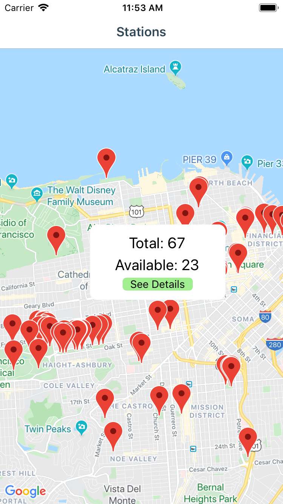
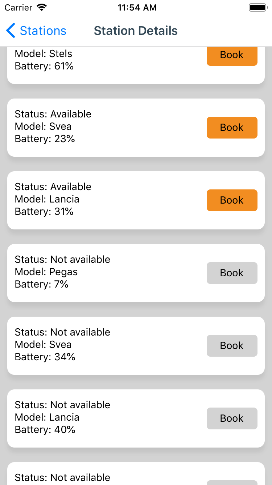

# EpicCycling
A test app displaying bicycle stations in San Francisco

How to build and run the app:

iOS:
1) npm run update
2) react-native run-ios or Run with Xcode

Android:
1) npm run update
2) react-native run-android

  
  
  

